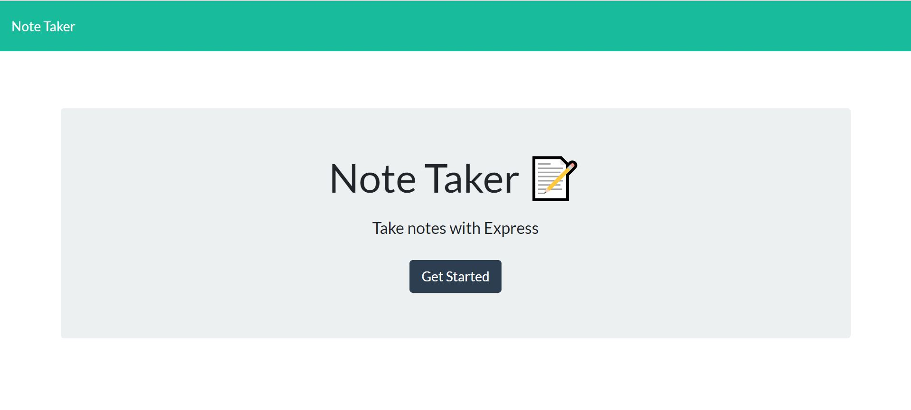
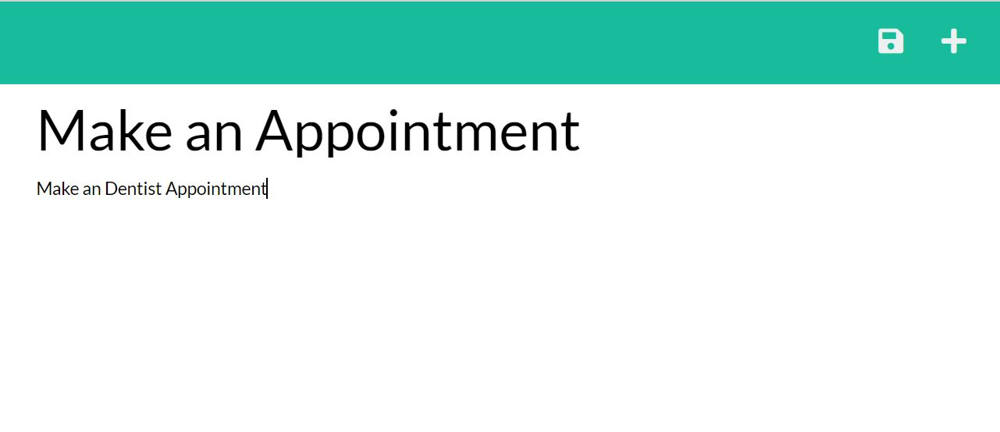
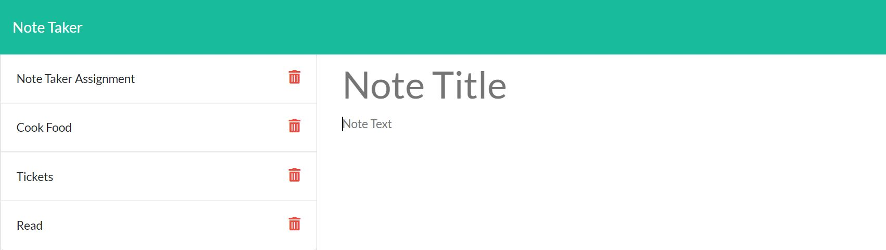
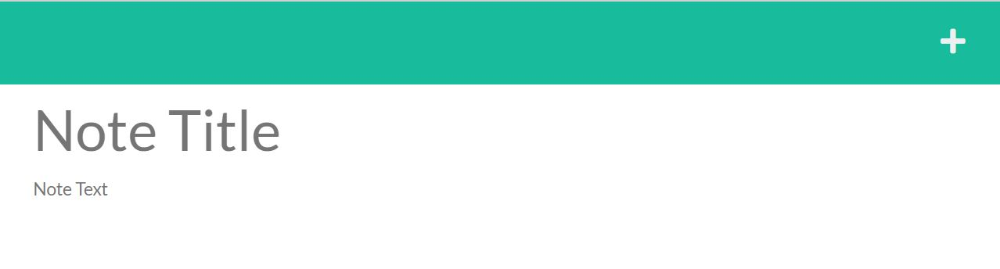

# Note Taker


<h4>Designed and coded by <a href="https://github.com/fizzaaz">FIZZA ZAIDI</a></h4>

This project was designed as a homework assignment for UT Austin coding bootcamp. This application emphasizes the use of express framework to create an node application. The challenge is to create an application called Note Taker that can be used to write, save and delete notes. This application will use an Express.js back end and will save and retrieve note data from a JSON file. For users that need to keep track of a lot of information, it's easy to forget or be unable to recall something important. Being able to take persistent notes allows users to have written information available when needed.

## Getting Started
🔍This entire application is deployed to Heroku. To get this project up and running, you can follow the deployment link. Or, clone the repository from GitHub to use this as a template.

* [GitHub Repository](https://github.com/fizzaaz/Note-Taker)
* [Deployed Application](https://notetake-r.herokuapp.com/)

# Table of Contents
* [Demo](#demo)
* [Technology](#technology)
* [Usage](#usage)
* [Features](#features)
* [License](#license)
* [Contribution](#contribution)
* [Questions](#questions)

# Demo :


# Application Preview : 
Main Page


Save Notes


Delete Notes


Add Notes


# Technology :

**1. [Express.js](https://expressjs.com/)** :

* Web Applications : Express is a minimal and flexible Node.js web application framework that provides a robust set of features for web and mobile applications.

* APIs : With a myriad of HTTP utility methods and middleware, creating a robust API is quick and easy.

* Performance : Express provides a thin layer of fundamental web application features, without obscuring Node.js features.

**2. [Node.js](https://nodejs.org/en/)** : 

* Node.js is an open-source and cross-platform JavaScript runtime environment. 

* A Node.js app is run in a single process, without creating a new thread for every request. 

* Node.js provides a set of asynchronous I/O primitives in its standard library that prevent JavaScript code from blocking.

**3. [uuid](https://www.npmjs.com/package/uuid)** : Creates random unique id's.

# Usage :

* Clone this repository to use this application on local machine.

* To install necessary dependencies, run the following command :

```
npm i
```

* The application will be invoked with the following command: This will start localhost server on PORT 3001.

```
node server.js
```

* Open browser and type `http://localhost:3001/` to run this application on your local machine.

# Features :

1. Used 'Express.js' to build server

2. Used 'fs(File System)' module to read and write from 'db.json' file.

3. Used [uuid](https://www.npmjs.com/package/uuid) npm package to give unique id to each note.

4. Application is deployed on [heroku](https://www.heroku.com/) : Heroku is a container-based cloud Platform as a Service (PaaS). Developers use Heroku to deploy, manage, and scale modern apps.

# User Requirements

* Able to write and save notes. 
* Able to delete notes I've written before.
* Able to organize my thoughts and keep track of tasks I need to complete.

# Project Requirements
* WHEN the user open the Note Taker THEN the user is presented with a landing page with a link to a notes page.
* WHEN the user click on the link to the notes page THEN the user is presented with a page with existing notes listed in the left-hand column, plus empty fields to enter a new note title and * the note’s text in the right-hand column
* WHEN the user enter a new note title and the note’s text THEN a Save icon appears in the navigation at the top of the page
* WHEN the user click on the Save icon THEN the new note the user have entered is saved and appears in the left-hand column with the other existing notes
* WHEN the user click on an existing note in the list in the left-hand column THEN that note appears in the right-hand column
* WHEN the user click on the Write icon in the navigation at the top of the page THEN the user is presented with empty fields to enter a new note title and the note’s text in the right-hand column

# License

  ✋ This project is licensed under MIT license.

# Contribution

  👪email me 

# Questions

 If you have any queries feel free to contact me at ✉️ fizz.zehra14@gmail.com.
 You can also reach me out through my Github profile at  👋[fizzaaz](https://github.com/fizzaaz/).